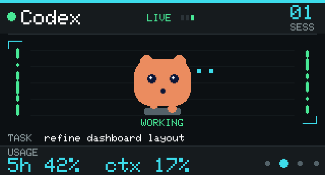
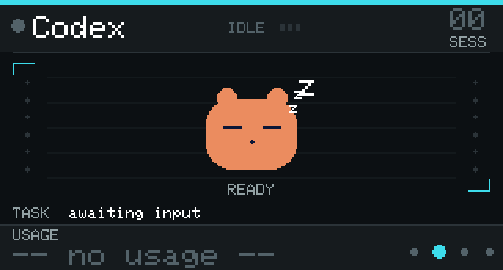
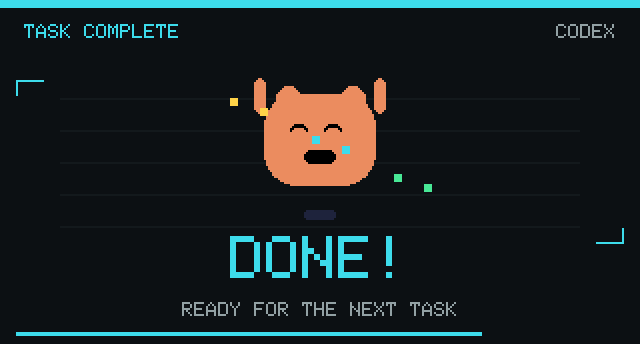
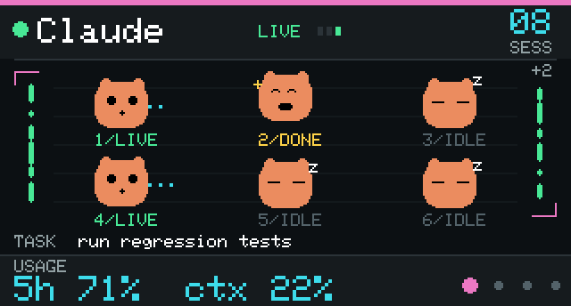
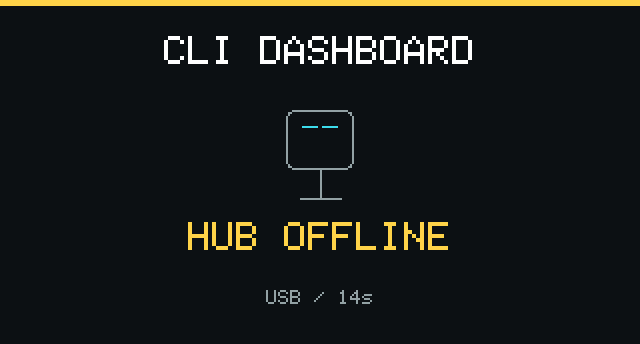
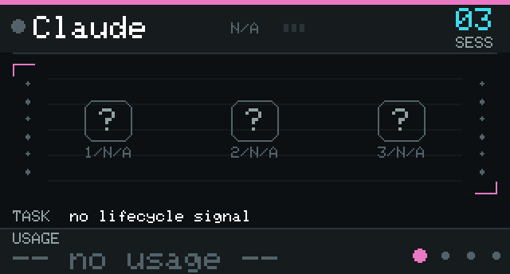

# CLI Dashboard

An ESP32-C6 LCD gadget that shows real-time activity of your AI CLI tools — Claude Code, Codex, Cursor, and Qoder — with an animated desk pet that reacts to what each tool is doing.

## Preview

Native-resolution mockups, scaled 2x without smoothing. Use `capture_screen.py`
below to capture the actual firmware framebuffer.

| Working | Idle |
|:-------:|:----:|
|  |  |
| Session running — pet bobs and types | No active sessions — pet snores z z z |

| Task finished | Multiple sessions |
|:-------------:|:-----------------:|
|  |  |
| Full-screen celebration with confetti | Mini-pet grid, one per open session |

| Boot splash | Mac display off |
|:-----------:|:---------------:|
|  |  |
| G badge slides left, 创意开发 typewriters in | Hub sends sleep packet, Z's float up |

| Wake animation | |
|:--------------:|:-|
|  | Screen wakes — 主人欢迎回来 typewriters in before dashboard resumes |

| Hub disconnected | Missing lifecycle events |
|:----------------:|:------------------------:|
|  |  |
| Explicit offline status after 12 seconds without host data | Process-only presence shows N/A, not IDLE |

The pet bobs and types while a session is running, celebrates with confetti when it finishes, and snores `z z z` when everything is idle.

---

## Hardware

| Part | Notes |
|------|-------|
| [Waveshare ESP32-C6-LCD-1.47](https://www.waveshare.com/esp32-c6-lcd-1.47.htm) | ST7789 display, 320×172, onboard WS2812 RGB LED |
| USB-C cable | data-capable (not charge-only) |
| Mac with Python 3 | hub + serial forwarder run here |

---

## Architecture

```
Other machines                 Mac (hub machine)              ESP32-C6
─────────────                  ─────────────────              ────────
Claude Code                    Claude Code
  claude_hook.py ─────────┐      claude_hook.py ──────────►  
  claude_statusline.py     │      mac_cli_hub.py :8722        cli_dashboard.ino
                           └────► POST /event                 ▲
Cursor                           GET /state ◄───────────────  │
  cursor_hook.py ─────────────►                               │
                                 mac_serial_forward.py ───────┘
Codex                              (polls /state, writes
  codex_notify.py ───────────────►  JSON to USB serial)
```

`mac_cli_hub.py` is the central hub — it collects hook events from any machine on the network and serves an aggregated JSON state. `mac_serial_forward.py` polls that JSON every 2 s and pushes it to the ESP32 over USB serial (no WiFi required on the board).

For local Codex sessions, `codex_rollout.py` incrementally reads lifecycle events
from `$CODEX_HOME/sessions` (default `~/.codex/sessions`). CLI, desktop/IDE and
exec sessions use the same reader; no Codex settings modification is required.
CPU usage and file modification time alone never mark a session as working.

---

## Setup

### 1. Flash the firmware

Install prerequisites (once):

```bash
# Download arduino-cli into the project folder
mkdir -p acli
curl -fsSL https://downloads.arduino.cc/arduino-cli/arduino-cli_latest_macOS_ARM64.tar.gz | tar -xz -C acli

# Install the ESP32 core
./acli/arduino-cli core install esp32:esp32
./acli/arduino-cli lib install "GFX Library for Arduino" ArduinoJson U8g2
```

Flash the board:

```bash
# Plug in the ESP32-C6 via USB-C, then:
bash mac_flash.sh
```

`mac_flash.sh` automatically finds the serial port, compiles, and uploads. It
pauses the registered serial LaunchAgent only after a successful compile and
restores it even if upload fails. Both `com.cli-dashboard.serial` and the older
`com.zeron.cliserial` labels are supported; set `CLI_SERIAL_PLIST` for a custom
plist. A manually started forwarder must be stopped before uploading.

### 2. Start the hub (Mac)

```bash
python3 mac_cli_hub.py
# Listening on http://0.0.0.0:8722/
```

The hub persists usage stats in `.hub_usage.json` so quota bars survive restarts.

### 3. Start the serial forwarder (Mac)

Run this in a second terminal (or as a LaunchAgent — see below):

```bash
python3 mac_serial_forward.py
```

It finds `/dev/cu.usbmodem*` automatically, reconnects if the board is unplugged, and sends a `{"sleep":true}` packet when the Mac display is off.

### 4. Register Claude Code hooks (this Mac)

Use the idempotent installer; it appends only missing hooks, keeps existing
integrations/status lines, and backs up the original settings before writing:

```bash
python3 install_local_hooks.py          # preview the missing entries
python3 install_local_hooks.py --apply
```

Reopen existing Claude sessions to ensure they load the hooks. If an existing
status line is preserved, add quota forwarding to it separately to show usage.
For manual registration, merge the following into `~/.claude/settings.json`:

```json
{
  "hooks": {
    "SessionStart":     [{"hooks": [{"type": "command", "command": "python3 /path/to/claude_hook.py start",  "timeout": 10}]}],
    "UserPromptSubmit": [{"hooks": [{"type": "command", "command": "python3 /path/to/claude_hook.py prompt", "timeout": 10}]}],
    "Stop":             [{"hooks": [{"type": "command", "command": "python3 /path/to/claude_hook.py stop",   "timeout": 10}]}],
    "SessionEnd":       [{"hooks": [{"type": "command", "command": "python3 /path/to/claude_hook.py end",    "timeout": 10}]}]
  },
  "statusLine": {
    "type": "command",
    "command": "python3 /path/to/claude_statusline.py",
    "padding": 0
  }
}
```

### 5. Connect from another machine

Run the installer on any remote machine, passing this Mac's IP:

```bash
bash install_remote_hooks.sh 192.168.x.x
```

The script:
- Writes `claude_hook.py` and `claude_statusline.py` to `~/.claude/cli_dashboard/`
- Patches `~/.claude/settings.json` automatically
- Tests connectivity to the hub

The hub URL can also be overridden per-machine without re-running the installer:

```bash
export CLI_HUB="http://192.168.x.x:8722"   # add to ~/.zshrc
```

---

## Run as a background service (optional)

To start hub + forwarder automatically on login, create two LaunchAgents:

Replace `/path/to/cli-dashboard` with the actual directory where you cloned the repo.

**`~/Library/LaunchAgents/com.cli-dashboard.hub.plist`**
```xml
<?xml version="1.0" encoding="UTF-8"?>
<!DOCTYPE plist PUBLIC "-//Apple//DTD PLIST 1.0//EN" "http://www.apple.com/DTDs/PropertyList-1.0.dtd">
<plist version="1.0"><dict>
  <key>Label</key><string>com.cli-dashboard.hub</string>
  <key>ProgramArguments</key><array>
    <string>/usr/bin/python3</string>
    <string>/path/to/cli-dashboard/mac_cli_hub.py</string>
  </array>
  <key>RunAtLoad</key><true/>
  <key>KeepAlive</key><true/>
</dict></plist>
```

**`~/Library/LaunchAgents/com.cli-dashboard.serial.plist`**
```xml
<?xml version="1.0" encoding="UTF-8"?>
<!DOCTYPE plist PUBLIC "-//Apple//DTD PLIST 1.0//EN" "http://www.apple.com/DTDs/PropertyList-1.0.dtd">
<plist version="1.0"><dict>
  <key>Label</key><string>com.cli-dashboard.serial</string>
  <key>ProgramArguments</key><array>
    <string>/usr/bin/python3</string>
    <string>/path/to/cli-dashboard/mac_serial_forward.py</string>
  </array>
  <key>RunAtLoad</key><true/>
  <key>KeepAlive</key><true/>
</dict></plist>
```

Load them:

```bash
launchctl load -w ~/Library/LaunchAgents/com.cli-dashboard.hub.plist
launchctl load -w ~/Library/LaunchAgents/com.cli-dashboard.serial.plist
```

---

## File reference

| File | Purpose |
|------|---------|
| `cli_dashboard.ino` | ESP32-C6 firmware — LCD rendering, animations, serial JSON parser |
| `cjk_glyphs.h` | 1-bit bitmaps for "创意开发" (splash screen) |
| `welcome_glyphs.h` | 1-bit bitmaps for "主人欢迎回来" (wake animation) |
| `generate_glyphs.py` | Regenerates `cjk_glyphs.h` from font |
| `generate_welcome_glyphs.py` | Regenerates `welcome_glyphs.h` from font |
| `mac_cli_hub.py` | Hub server — aggregates events, serves `/state` JSON |
| `mac_serial_forward.py` | Polls hub, writes state to ESP32 over USB serial |
| `mac_flash.sh` | Compiles and uploads firmware via arduino-cli |
| `mac_stage_core.py` | One-off helper to stage ESP32 core via Espressif mirror |
| `claude_hook.py` | Claude Code hook → hub bridge |
| `claude_statusline.py` | Claude Code statusLine → hub bridge (usage/quota) |
| `cursor_hook.py` | Cursor hook → hub bridge |
| `codex_notify.py` | Codex notify → hub bridge |
| `codex_rollout.py` | Incremental local Codex lifecycle and per-thread usage reader |
| `install_local_hooks.py` | Additive, backed-up Claude hook installation |
| `install_remote_hooks.sh` | Installer for remote machines |
| `generate_screenshots.py` | Offline, native-pixel preview generator (Pillow) |
| `capture_screen.py` | Capture the real LCD framebuffer over USB (Pillow) |
| `tests/test_dashboard.py` | Hub focus, payload, layout and capture regression tests |
| `tests/test_rollouts.py` | Lifecycle, incremental I/O, deduplication and HTTP regression tests |
| `tests/test_hooks.py` | Hook installation and privacy regression tests |

---

## Hub API

```
POST /event   { cli, session, type, turn?, title?, usage? }
              type: start | prompt | stop | cancel | error | end | usage | focus

GET  /state   aggregated state JSON consumed by mac_serial_forward.py
GET  /health  "ok"
```

All hooks post to `/event`. The forwarder reads `/state`. Both endpoints are unauthenticated — intended for local network use only.
To select Codex, post `{"cli":"codex","type":"focus"}` to `/event`. The hub
persists the selection and includes `view` and `focus_rev` in `/state`. The
device applies a focus command once, so subsequent polling does not undo BOOT
button presses. Posting focus again reselects the channel, even if unchanged.
`CLI_DASHBOARD_FOCUS` overrides the persisted selection at hub startup.

`start` and `usage` update presence only. `prompt` starts a turn; `stop` completes
it; `cancel`/`error` end it without celebration. New prompts clear the preceding
done state. Supply a stable `turn` ID where available so delivery retries and
multiple event sources cannot flash the same completion twice.

Each channel includes `observed` (sessions with lifecycle events) and `untracked`
(usage-only or additional process-only presence). Only observed sessions can be `running`.
Active sessions are sorted first so recent idle sessions cannot hide them.
Untracked sessions render as `N/A` with a question mark; they are not assumed
idle. Flash the updated firmware when upgrading the hub to this protocol.

### Codex Lifecycle

- Tracks `task_started`/`turn_started`, explicit completion, cancellation and
  terminal-failure records. Token counts, assistant messages, metadata and
  retryable errors are not lifecycle transitions.
- Uses thread IDs, excludes explicitly tagged subagents, and deduplicates
  completion notifications by thread and turn. Hub startup rebuilds state
  without replaying historical LED notifications.
- Polls tracked files every second; discovers new/resumed files every 10 s.
  Reads at most 1 MiB per file per poll and waits for complete JSONL lines.
  Large history files can take several polls to catch up. Invalid/oversized
  lines, truncation and replacement do not turn into false completions.
- Shows recently observed Codex sessions, not the number of open UI tabs.
  Completed/idle sessions age out after 5 min. A running turn expires after
  30 min without another timestamped record, preventing abandoned logs from
  staying live indefinitely. This timeout is conservative, not proof of exit.
- Displays the workspace basename, not prompt/tool contents. Usage is taken
  from the matching thread. The hub and Claude bridges no longer dump raw
  event/statusline payloads.

Rollout JSONL is a version-dependent local format, not a stable public API.
Unsupported schemas are ignored rather than guessed. `codex_notify.py` remains
an optional completion fallback with the original notifier passthrough; it
requires both `thread-id` and `turn-id`, and respects `CLI_HUB`/`CODEX_HOME`.

---

## Display

The BOOT button (GPIO9) cycles through the four channels: Claude → Codex → Cursor
→ Qoder. Codex is the default at power-on. Completion overlays return to the
selected channel, and BOOT dismisses an overlay.

| Pet state | Meaning |
|-----------|---------|
| Typing animation | Session is running |
| Confetti celebration | Just finished (2 s) |
| Snoring `z z z` | No active sessions |
| `?` / `N/A` | Process present, but no lifecycle signal |

The dashboard has a channel-colored header, activity indicators, a task title
and a separate usage footer. Task titles support Chinese and are clipped at
UTF-8 character boundaries. Up to six sessions are shown with per-session
states; `+N` indicates additional sessions. The LED uses the completed channel's
color. Idle sessions remain visible; a missing heartbeat shows `HUB OFFLINE`
instead of silently returning to the boot logo.

## Verification And Capture

```bash
python3 -m pip install Pillow
python3 -m unittest discover -s tests -v
python3 generate_screenshots.py
python3 capture_screen.py /tmp/cli-dashboard-live.png
# Opt-in: temporarily display test states on the connected board, then restore live data.
python3 tests/hardware_smoke.py
```

The preview generator reads the GFX library's bitmap font from the standard
Arduino sketchbook location. Set `GFX_FONT` to your `glcdfont.h` when using a
custom sketchbook. Previews are illustrative; CJK task font metrics and some
primitive edges can differ from the real display.

Capture temporarily suspends this checkout's forwarder and resumes it in a
`finally` block. It does not inject sample sessions or modify the hub. With
multiple USB devices connected, specify `--port /dev/cu.usbmodem...`. Firmware
responds to `{"capture":true}` with `FRAME 320 172 RGB565LE <view>\n` followed by 110080
bytes. The captured pixels are the canvas sent to the LCD, not a camera photo.

Process-only counts for tools without hooks remain approximate and do not imply
activity. Accurate physical tab enumeration and an authenticated LAN hub are
separate follow-up improvements.
